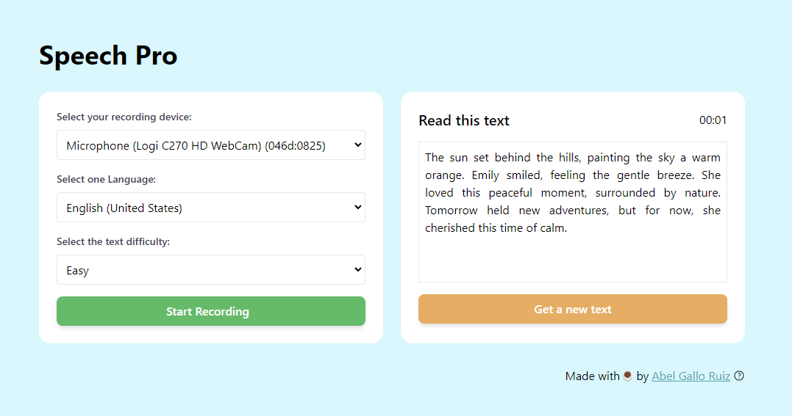

# SPEECH-PRO

## Introduction



The Speech-Pro is a web application that allows users to generate text from speech using the Open AI API. The application is divided into two parts: the frontend and the backend. The frontend is responsible for capturing the user's speech and sending it to the backend, which in turn sends the speech to the Open AI API and returns the generated text to the frontend.

The application is intented to be used as a speech to text to recognize the user's speech and match the recognized speech with the generated text. Is useful for people with speech problems or people who want to improve their speech (e.g., people with autism, people with speech problems, people who want to learn a new language, etc.).

## Backend

The backend is a simple server that listens for the "random" text generated by the Open AI API. The server is built using the Bun framework, which is a lightweight web framework to handle the Simple HTTP requests and the WebSocket connections.

The text recognition is done using the Open AI API, which requires an API key to work. The API key is stored in the `.env` file, which is setted up by the user.

### Prerequisites

- Bun 1.x.x
- Open AI [API Key](https://platform.openai.com/api-keys)

### Installation

1. Clone the repository
2. Install dependencies on the root folder of the backend folder

```bash
bun install
```

3. Modify the `.env` file with your Open AI API Key and the port you want to use
4. Run the server

```bash
bun start
```

## Frontend

The frontend is a simple web page that captures the user's speech and sends it to the backend. The frontend is built using HTML, CSS, and JavaScript.

The frontend uses the "AlpineJs" library to handle the user's speech and the "Tailwind CSS" library to style the page.

### Prerequisites

- Tailwind CSS CLI 3.x.x
- A web server to serve the frontend files (e.g., Python, Nginx, simple-http-server, etc.)

### Installation

1. Clone the repository
2. Serve the frontend files using a web server

```bash
# Using simple-http-server
simple-http-server .

# Using Python
python -m http.server

# Using PHP
php -S localhost:8000

# Using Nginx
# Copy the files to the Nginx root folder
```

4. Open the browser and navigate to the server address

#### Tailwind CSS CLI

The Tailwind CSS CLI is used to compile the Tailwind CSS styles. The CLI is installed using npm.

```bash
npm install -g tailwindcss
```

To compile the Tailwind CSS styles, run the following command:

```bash
tailwindcss build styles.scss -o styles/styles.css --watch --minify
```

### Configuration

The configuration of the frontend is done by modifying the `VARIABLES` section on the `script.js` file. The variables are:

```javascript
// Backend URL
const BACKEND_URL = "http://localhost:3000";
// Websocket URL
const WEBSOCKET_URL = "ws://localhost:3000";
// Version of the application
const VERSION = "1.0.0";
// Last updated date
const LAST_UPDATED = "11/04/2024";
```

## License

The Speech-Pro is licensed under the MIT License. See the [LICENSE](LICENSE) file for more information.

## Contact

For more information, please contact me at [Email](mailto:abelgalloruiz@gmail.com)

## TODO:

- [ ] Add more languages
- [ ] Add more speech recognition APIs
- [ ] Add personal records
- [ ] Add software tests
